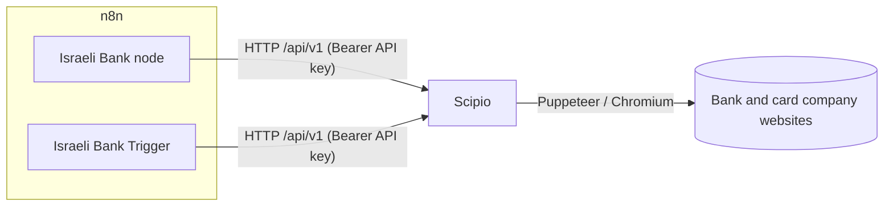

# n8n-nodes-israeli-banks

[](https://github.com/t0mer/t0mer-n8n-nodes-israeli-banks/actions/workflows/ci.yml)
[](LICENSE)

Israeli bank and credit-card transactions in [n8n](https://n8n.io) workflows.

This package is a thin client for **[Scipio](https://github.com/t0mer/scipio)**, a self-hosted REST API that wraps [`israeli-bank-scrapers`](https://github.com/eshaham/israeli-bank-scrapers). Scipio does the browser automation (Puppeteer and Chromium); these nodes only make HTTP calls to it. That is why the package has **no runtime dependencies** and runs on the standard n8n image.

> **You need a running Scipio instance.** The nodes do nothing without one.



- [Requirements](#requirements)
- [Installation](#installation)
- [Credentials](#credentials)
- [Israeli Bank node](#israeli-bank-node)
- [Israeli Bank Trigger node](#israeli-bank-trigger-node)
- [One Zero two-factor walkthrough](#one-zero-two-factor-walkthrough)
- [Example workflows](#example-workflows)
- [Security notes](#security-notes)
- [Troubleshooting](#troubleshooting)
- [Development](#development)
- [Contributing](#contributing)
- [Usage terms](#usage-terms)
- [Disclaimer](#disclaimer)
- [License](#license)

## Requirements

- n8n (self-hosted), with community nodes enabled.
- Scipio (`techblog/scipio` Docker image), reachable from n8n.

A minimal `docker-compose.yml` that runs both on a private network:

```yaml
services:
  n8n:
    image: docker.n8n.io/n8nio/n8n:latest
    ports:
      - "5678:5678"
    volumes:
      - n8n-data:/home/node/.n8n
    restart: unless-stopped

  scipio:
    image: techblog/scipio:latest
    environment:
      API_TOKENS: "change-me-long-random-token"   # the API key for the Scipio API credential
    shm_size: '1gb'                                # Chromium needs shared memory
    security_opt:
      - no-new-privileges:true
    cap_drop:
      - ALL
    restart: unless-stopped
    # No published port: n8n reaches it at http://scipio:8080 on the compose network.

volumes:
  n8n-data:
```

In n8n, the Scipio API credential then uses **Base URL** `http://scipio:8080` and **API Key** `change-me-long-random-token`.

Scipio settings that affect these nodes (all Scipio environment variables, see the [Scipio README](https://github.com/t0mer/scipio#configuration)):

| Variable | Default | Why it matters here |
|---|---|---|
| `API_TOKENS` | none | The API key(s) for the Scipio API credential. Without tokens, Scipio binds to `127.0.0.1` only (unless `ALLOW_INSECURE=true`), so n8n in another container can't reach it. |
| `SYNC_SCRAPE_TIMEOUT_SECONDS` | `240` | Limit for the **Synchronous Request** scrape method. |
| `JOB_RESULT_TTL_SECONDS` | `900` | How long a finished job and its result are kept. |
| `OTP_WAIT_TIMEOUT_SECONDS` | `300` | How long a job waits in `waiting_for_otp`. |
| `RATE_LIMIT_MAX` / `RATE_LIMIT_WINDOW_SECONDS` | `10` / `900` | Job and scrape creations, and Two-Factor (`/api/v1/2fa/*`) requests, allowed per API token (or client IP) per window. |
| `QUEUE_LIMIT` | `20` | Pending jobs before Scipio answers `QUEUE_FULL`. |

## Installation

In n8n, go to **Settings → Community Nodes → Install** and enter:

```
@t0mer/n8n-nodes-israeli-banks
```

This adds two nodes, **Israeli Bank** and **Israeli Bank Trigger**, and two credential types.

> **Not on npm yet.** At the time of writing, no version of `@t0mer/n8n-nodes-israeli-banks` has been published to npm, so the install above fails until the first release. Until then, build it from source (below). <!-- TODO: verify once the first version is published -->

### Manual install (npm)

For self-hosted n8n without the community nodes UI (for example with queue mode), install the package into n8n's custom nodes folder and restart n8n:

```bash
# Docker: run this inside the n8n container
mkdir -p ~/.n8n/nodes && cd ~/.n8n/nodes
npm install @t0mer/n8n-nodes-israeli-banks
```

### From source

```bash
git clone https://github.com/t0mer/t0mer-n8n-nodes-israeli-banks.git
cd t0mer-n8n-nodes-israeli-banks
npm ci
npm run build
npm pack                          # creates t0mer-n8n-nodes-israeli-banks-<version>.tgz
cd ~/.n8n/nodes && npm install /path/to/t0mer-n8n-nodes-israeli-banks-<version>.tgz
```

Then restart n8n.

## Credentials

### Scipio API credential

Tells n8n how to reach your Scipio server. Every operation needs it.

| Field | Description |
|---|---|
| Base URL | Root URL of Scipio, for example `http://scipio:8080`. Leave out `/api/v1`. A trailing slash is fine. |
| API Key | One of the tokens in Scipio's `API_TOKENS`. It is sent as `Authorization: Bearer <key>`. Leave it empty only if Scipio runs without tokens. |
| Ignore SSL Issues (Insecure) | Accept invalid or self-signed certificates (home-lab TLS). Off by default. |

**Test** calls `GET /api/v1/companies`, which checks both the URL and the key.

### Israeli Bank Account credential

In n8n this credential type is called **Israeli Bank Account API**. It holds one bank or card login, so create one credential per account. First pick the **Bank or Card Company** (default: Bank Hapoalim); the form then shows only the fields that company needs. Only those fields are sent to Scipio.

| Company | Company ID | Fields |
|---|---|---|
| Bank Hapoalim (הפועלים) | `hapoalim` | User Code, Password |
| Bank Leumi (לאומי) | `leumi` | Username, Password |
| Mizrahi Tefahot (מזרחי טפחות) | `mizrahi` | Username, Password |
| Discount Bank (דיסקונט) | `discount` | ID Number, Password, User Identification Code (num) |
| Mercantile Bank (מרכנתיל) | `mercantile` | ID Number, Password, User Identification Code (num) |
| Otsar Hahayal (אוצר החייל) | `otsarHahayal` | Username, Password |
| Max (מקס) | `max` | Username, Password |
| Visa Cal (כאל) | `visaCal` | Username, Password |
| Isracard (ישראכרט) | `isracard` | ID Number, Card Last 6 Digits, Password |
| Amex Israel (אמריקן אקספרס) | `amex` | ID Number, Card Last 6 Digits, Password |
| Union Bank (איגוד) | `union` | Username, Password |
| First International (Beinleumi) (הבינלאומי) | `beinleumi` | Username, Password |
| Massad (מסד) | `massad` | Username, Password |
| Bank Yahav (יהב) | `yahav` | Username, National ID, Password |
| Beyahad Bishvilha (ביחד בשבילך) | `beyahadBishvilha` | ID Number, Password |
| Behatsdaa (בהצדעה) | `behatsdaa` | ID Number, Password |
| Pagi (פאג"י) | `pagi` | Username, Password |
| One Zero (וואן זירו), experimental, 2FA | `oneZero` | Email, Password, plus OTP Long-Term Token **or** Phone Number |

The list lives in [`shared/companies.ts`](shared/companies.ts) and matches Scipio's `GET /api/v1/companies`. Use **Company → Get Many** to see what your Scipio version supports.

**Testing this credential never logs in to the bank.** A real login is slow, can send an SMS, and repeated attempts can lock the account. The **Test** button only checks that the company's required fields are filled in. The first real check is your first scrape.

## Israeli Bank node

Every operation needs the Scipio API credential. Operations that scrape (Transaction → Get Many, Job → Create) and the Two-Factor operations also need an Israeli Bank Account credential. The node can be used as a tool by AI agents.

| Resource | Operations |
|---|---|
| Transaction | Get Many |
| Company | Get Many |
| Job | Create, Get Status, Get Result, Submit OTP, Cancel |
| Two-Factor | Send OTP, Get Long-Term Token |
| System | Get Version |

### Transaction → Get Many

Runs a full scrape and returns the transactions. Scrapes usually take 30 seconds to 3 minutes. There are two ways to run it (**Scrape Method**):

- **Async Job (Recommended)**, the default: creates a Scipio job, polls it until it finishes, and fetches the result. Every request is short, so this is safe behind reverse proxies. On a timeout the job is cancelled, and OTP prompts are detected.
- **Synchronous Request**: a single `POST /api/v1/scrape` that waits for the whole scrape. It's simpler (one request, no polling), but:
  - A reverse proxy between n8n and Scipio may cut the connection.
  - **Max Wait Seconds** is the HTTP timeout. Scipio has its own limit, `SYNC_SCRAPE_TIMEOUT_SECONDS` (default 240), and returns 504 when it's reached. Set Max Wait Seconds above that limit to get Scipio's clearer error; otherwise the node gives up first and reports "Scipio did not respond within N seconds".
  - **Nothing is cancelled on a timeout.** The scrape keeps running on Scipio, so retrying right away logs in to the bank a second time.
  - It rejects 2FA companies (One Zero) that have no long-term token.

  Use it only when n8n reaches Scipio directly, for example on the same Docker network.

| Parameter | Description |
|---|---|
| Scrape Method | **Async Job (Recommended)** or **Synchronous Request** (see above). |
| Start Date Mode | **Lookback Days** (default) or **Fixed Date**. |
| Lookback Days | 1–365, default 30. The start date is today minus N days (UTC date). |
| Start Date | Required with Fixed Date. |
| Output Mode | **Transactions** (default): one item per transaction, with `accountNumber` and `balance` merged in. **Accounts**: one item per account, with transactions nested under `txns`. **Raw**: one item holding Scipio's full, unfiltered result. |
| Status Filter | **Completed Only** (default), **Pending Only**, or **All**. Used by the Transactions and Accounts modes. |

**Options**

| Option | Description |
|---|---|
| Additional Transaction Information | Fetch extra details per transaction where the bank supports it (slower). |
| Combine Installments | Combine installment payments into one transaction. |
| Future Months to Scrape | Default 1. Months ahead to scrape (card companies). |
| Include Raw Transaction | Add the bank's raw transaction object. |
| Opt-In Feature Names or IDs | Library opt-in behaviours, loaded from Scipio's `GET /api/v1/companies`. Each one only affects the company in its prefix (for example `mizrahi:*` only affects Mizrahi, `isracard-amex:*` only Isracard and Amex). |
| Max Wait Seconds | Default 300, minimum 10. In Async Job mode, if the scrape hasn't finished by then, the node cancels the job and fails. With Synchronous Request, this is the HTTP timeout, and nothing is cancelled (see above). |
| Poll Interval Seconds | Default 5, minimum 2. Async Job only. |

**Output conventions**

- Dates are the library's ISO strings, unchanged. In the Transactions and Accounts modes, each transaction also gets **`date_local`** (`YYYY-MM-DD` in Asia/Jerusalem), because the library's timestamps are timezone-shifted: midnight in Israel shows up as 21:00 or 22:00 UTC the day before.
- Amounts are unchanged. A negative `chargedAmount` is a debit. Amounts can be `null` when the bank returns a non-numeric value.
- Every transaction item includes `companyId`, `accountNumber` and `balance` (`null` when the bank doesn't report one). Account items and the Raw item also get `companyId`.
- Other transaction fields come from the scraper library as-is, for example `type`, `identifier`, `date`, `processedDate`, `originalAmount`, `originalCurrency`, `chargedAmount`, `chargedCurrency`, `description`, `memo`, `status`, `installments` and `category`.
- `futureDebits`, when the bank provides them, appear only in the Accounts mode (added to each account item) and the Raw mode.

**Errors**

When the bank scrape fails, the node maps Scipio's `errorType` to a message (Scipio's own error text is appended in parentheses):

| Scipio error type | Message | Hint |
|---|---|---|
| `INVALID_PASSWORD` | The bank rejected the login details | Check the Israeli Bank Account credential. |
| `CHANGE_PASSWORD` | The bank requires a password change | Log in on the bank's website, change the password, then update the credential. |
| `ACCOUNT_BLOCKED` | The bank account is blocked | Contact the bank or unblock the account first. |
| `TIMEOUT` | The scrape timed out | The bank's site was slow, or an OTP wasn't submitted in time. |
| `TWO_FACTOR_RETRIEVER_MISSING` | The bank requires two-factor authentication | See [One Zero](#one-zero-two-factor-walkthrough) below. |
| `GENERAL_ERROR` | The scrape failed with a general error | Check the Scipio logs. |
| `GENERIC` (and any unknown type) | The scrape failed | Check the Scipio logs. |

HTTP errors from Scipio are shown as `Scipio error <code>: <message>`, with a hint for the common cases. When Scipio's error includes `details`, the node shows `Details: …` (redacted) instead of the hint.

| Code / status | Hint |
|---|---|
| 401 | Check the API key in the Scipio API credential. |
| `RATE_LIMITED` | Poll less often, or raise `RATE_LIMIT_MAX` on Scipio. |
| `QUEUE_FULL` | Scipio has too many queued jobs. Try again later. |
| `TWO_FACTOR_REQUIRED` | One Zero needs an OTP Long-Term Token in the credential; for the interactive OTP flow (Job → Create), fill in Phone Number instead. |
| 404 | The job or route wasn't found; jobs expire after Scipio's result TTL. |
| 504 with code `TIMEOUT` | Scipio's synchronous scrape limit (`SYNC_SCRAPE_TIMEOUT_SECONDS`) was reached; use Scrape Method: Async Job. |
| Other 502, 503, 504 | A proxy or gateway between n8n and Scipio failed or timed out; use Scrape Method: Async Job. |

If n8n can't reach Scipio at all (DNS, refused connection, TLS), the message is "Could not reach Scipio"; check the Base URL and that the container is running.

With Synchronous Request, the node can also fail with:
- HTTP **504**, when Scipio's sync limit is reached (switch to Async Job).
- "Scipio did not respond within N seconds", when Max Wait Seconds runs out first.
- **422 `TWO_FACTOR_REQUIRED`**, for One Zero without a long-term token.

In Async Job mode, if the job doesn't finish within Max Wait Seconds, the node cancels it and fails with "The scrape did not finish within N seconds". If the job stops to wait for an OTP, Get Many cancels it (it holds a Scipio browser slot and can't be completed from there) and fails with a message explaining the manual Job flow. With **Continue On Fail** enabled, each failed item becomes `{ error, errorType, jobId }`. Error messages never include credential values.

### Company → Get Many

Lists the companies Scipio supports, one item each (`companyId`, `name`, `loginFields`, `requiresTwoFactor`).

### Job (advanced)

For manual async and OTP flows, for example combined with n8n's **Wait** node.

| Operation | Description |
|---|---|
| Create | Starts a scrape job and returns `{ jobId, status, companyId }` immediately. Takes the same start date fields and scraper options as Get Many, except Max Wait Seconds and Poll Interval Seconds. |
| Get Status | Takes **Job ID**. Returns the status (`queued`, `running`, `waiting_for_otp`, `succeeded` or `failed`), progress events and queue position. |
| Get Result | Takes **Job ID**. Returns `{ jobId, ...result }` with Scipio's raw result. Fails with "The job has not finished yet" while the job is still running. Note that a failed bank login still has job status `succeeded`; check `success` and `errorType` in the result. |
| Submit OTP | Takes **Job ID** and **OTP Code**. Sends the one-time password to a job in `waiting_for_otp` and returns `{ jobId, submitted: true }`. |
| Cancel | Takes **Job ID**. Cancels and deletes the job, and returns `{ jobId, deleted: true }`. |

Scipio drops finished jobs after its result TTL (`JOB_RESULT_TTL_SECONDS`, 15 minutes by default), and a job waits for an OTP for `OTP_WAIT_TIMEOUT_SECONDS` (5 minutes by default).

### Two-Factor (One Zero)

| Operation | Description |
|---|---|
| Send OTP | Sends an SMS code to the credential's Phone Number. Fails if the credential has no phone number. |
| Get Long-Term Token | Exchanges the SMS code (**OTP Code**) for a long-term token, returned as `longTermTwoFactorAuthToken`. |

Both operations fail with "Two-Factor operations only work with One Zero" when the selected credential is for another company.

### System → Get Version

Calls Scipio's public `GET /version` and returns `version` (Scipio), `libraryVersion` (the scraper library) and `commit`.

## Israeli Bank Trigger node

A polling trigger that starts the workflow for **new** transactions only. Every poll runs an async Scipio job (the same flow as Async Job above) for the last Lookback Days, then compares the result with what it has already seen.

| Parameter | Description |
|---|---|
| Event | **New Completed Transaction** (default) or **New Transaction (Including Pending)**. |
| Lookback Days | Default 7. The window scraped on every poll. Keep it longer than the poll interval so late-posting transactions are still caught. |
| Options | The scraper options above (including Max Wait Seconds and Poll Interval Seconds), plus **Emit Existing on First Run** (default off). |

> **Poll every 4 hours or less often.** Banks rate-limit logins and may flag or block accounts that log in too frequently. Scipio also rate-limits job creation and the Two-Factor endpoints (10 per 15 minutes per token by default), so Two-Factor operations can fail with `RATE_LIMITED` too. n8n owns the schedule, so the node can't enforce this; set the interval yourself.

**How deduplication works**

- On each poll the trigger scrapes the lookback window. It keeps a key for every transaction it has already seen, stored in the workflow's static data.
- The key is `companyId|accountNumber|identifier|status`. When a transaction has no identifier, the key is built from its date, charged amount, description, memo and installment number instead.
- The status is part of the key. So:
  - **New Completed Transaction**: pending transactions are ignored, and each transaction is emitted once, when it completes.
  - **New Transaction (Including Pending)**: a transaction can be emitted **twice**, once while pending and again when completed.
- **First activation emits nothing.** The trigger records what is already in the window, so turning on the workflow doesn't flood it with history. Enable **Emit Existing on First Run** to change this.
- Keys whose transaction date is older than lookback days + 14 are pruned, so the stored state stays small. A key is kept as long as the bank still returns that transaction, so it isn't emitted again.
- **Manual test** (the "Fetch Test Event" button) returns up to the 5 most recent matching transactions and doesn't change the stored state.
- If a scrape fails, the trigger reports the error and leaves its state unchanged.
- **One Zero** needs an OTP Long-Term Token in the credential to be used with the trigger. Otherwise every poll would send an SMS that nobody can answer, so the trigger refuses to run.

## One Zero two-factor walkthrough

One Zero requires an SMS code on login. To avoid entering it every time, get a long-term token once:

1. Create an **Israeli Bank Account** credential with company **One Zero**. Fill in Email, Password and **Phone Number** (international format, e.g. `+972501234567`).
2. Add an **Israeli Bank** node: **Two-Factor → Send OTP**, using that credential. Run it; an SMS arrives.
3. Change the operation to **Two-Factor → Get Long-Term Token**, put the SMS code in **OTP Code**, and run it again (soon; Scipio keeps the pending session for a short time).
4. Copy `longTermTwoFactorAuthToken` from the output into the credential's **OTP Long-Term Token** field and save. The node never edits credentials itself.

The token is also stored in that execution's history. Delete the execution afterwards, or turn off saving successful executions for the workflow you use for this.

From then on, scrapes use the token and no SMS is needed. When a token is set, the phone number is ignored for scraping.

Without a token, a One Zero scrape stops at `waiting_for_otp`. Use **Job → Create**, then a **Wait** node (for example, "resume on webhook call" with the code), then **Job → Submit OTP** and **Job → Get Result**.

## Example workflows

Import these from [`examples/`](examples/) (**Workflows → Import from File**), then attach your own credentials:

| File | What it does |
|---|---|
| [`daily-transactions-to-google-sheets.json`](examples/daily-transactions-to-google-sheets.json) | The trigger polls every day at 07:00 (7-day lookback) and appends each new completed transaction to the `Transactions` sheet: date (`date_local`), company, account, description, amount, currency and memo. Dedup means late-posting transactions are still added, and never twice. Replace `YOUR_SHEET_ID` and attach a Google Sheets credential. |
| [`new-card-transaction-telegram-alert.json`](examples/new-card-transaction-telegram-alert.json) | The trigger polls a card every 4 hours and sends a Telegram message per new completed transaction, with the description, amount, currency, date, card number and installment (if any). Replace `YOUR_CHAT_ID` and attach a Telegram credential. |
| [`monthly-spend-summary-ai-agent.json`](examples/monthly-spend-summary-ai-agent.json) | On the 1st of the month at 08:00, Transaction → Get Many fetches 35 days of completed transactions, a Code node keeps only last calendar month (by `date_local`), and an AI Agent with an Anthropic chat model summarises spending by category, the top 5 merchants and anything unusual. Attach an Anthropic credential (or swap the chat model). |

## Security notes

- Bank credentials are stored **encrypted** in n8n's credential store. They are never node parameters, never logged, and never included in output.
- They are sent only to **your** Scipio server, in the body of `POST /api/v1/jobs` (or `POST /api/v1/scrape` with Synchronous Request). Scipio scrubs them from a job once it finishes.
- Scipio keeps results **in memory only**, and only for a limited time (`JOB_RESULT_TTL_SECONDS`, 15 minutes by default).
- Error messages from Scipio are sanitised: fields named like `password`, `token`, `otp`, `id` or `card` are redacted, and any credential value found in the text is replaced.
- **Run Scipio on a private network.** Don't expose it to the internet. Always set `API_TOKENS`, and use HTTPS if traffic leaves the host. Keep **Ignore SSL Issues** off unless you use a self-signed certificate you control.
- Transaction data is sensitive financial data. It ends up in n8n's execution history and in whatever the workflow sends it to (sheets, chat apps, AI models), so review execution-saving settings and those destinations.

## Troubleshooting

- **"Could not reach Scipio"**: the Base URL is wrong, or Scipio isn't running. If Scipio has no `API_TOKENS`, it only listens on `127.0.0.1`, so another container can't reach it.
- **401 from Scipio**: the API key doesn't match any of Scipio's `API_TOKENS`.
- **`RATE_LIMITED`**: too many scrapes in the window. Poll less often; the trigger should run every 4 hours or less often.
- **"Scipio did not respond within N seconds" or 504**: use Scrape Method **Async Job**.
- **"The bank is waiting for a one-time password (OTP)"**: see the [One Zero walkthrough](#one-zero-two-factor-walkthrough).
- **"The scrape did not finish within N seconds"**: raise Max Wait Seconds, or check Scipio's queue (`MAX_CONCURRENT_SCRAPES`) and logs.

## Development

```bash
npm ci
npm run lint        # n8n community-node lint rules
npm run build
npm run typecheck   # includes the tests
npm test            # vitest, no network access
npm run dev         # n8n with this package loaded at http://localhost:5678
```

For end-to-end testing, run Scipio locally (see the compose file above) and point the Scipio API credential at it. CI never talks to real banks.

Project layout:

```
credentials/   Scipio API and Israeli Bank Account credentials
nodes/         IsraeliBank (action) and IsraeliBankTrigger (polling trigger)
shared/        Scipio client, job runner, result mapping, dedup, errors, company list
tests/         vitest unit tests and a Scipio /companies fixture
examples/      importable example workflows
```

CI (`.github/workflows/ci.yml`) runs on pull requests and pushes to `main`: it checks that there are no runtime dependencies, then runs lint, build, typecheck and tests, plus a Trivy filesystem scan.

`npm run release` tags the version, and the tag triggers the publish workflow (`.github/workflows/publish.yml`), which runs the tests, publishes to npm with provenance and then runs `@n8n/scan-community-package` on the published package.

## Contributing

Issues and pull requests are welcome. Please run `npm run lint`, `npm run typecheck` and `npm test` before opening a PR. Bank-specific scraping problems usually belong in Scipio or [`israeli-bank-scrapers`](https://github.com/eshaham/israeli-bank-scrapers), not in this package.

## Usage terms

- **Your bank's terms apply.** Automated access to online banking may be restricted by your bank's or card company's terms of service. Check them before use; you are responsible for how you use your own accounts.
- **Scipio** is a separate project with its own license ([Apache-2.0](https://github.com/t0mer/scipio/blob/main/LICENSE)). The actual scraping is done by [`israeli-bank-scrapers`](https://github.com/eshaham/israeli-bank-scrapers), under its own license.
- Keep polling infrequent. Banks rate-limit logins and may block accounts that log in too often.

## Disclaimer

This is an **unofficial** project. It is not affiliated with, endorsed by, or connected to any bank or credit-card company. Scraping depends on the banks' websites and can break whenever they change. Use at your own risk, and check your bank's terms of service.

## License

[MIT](LICENSE) © 2026 Tomer Klein
